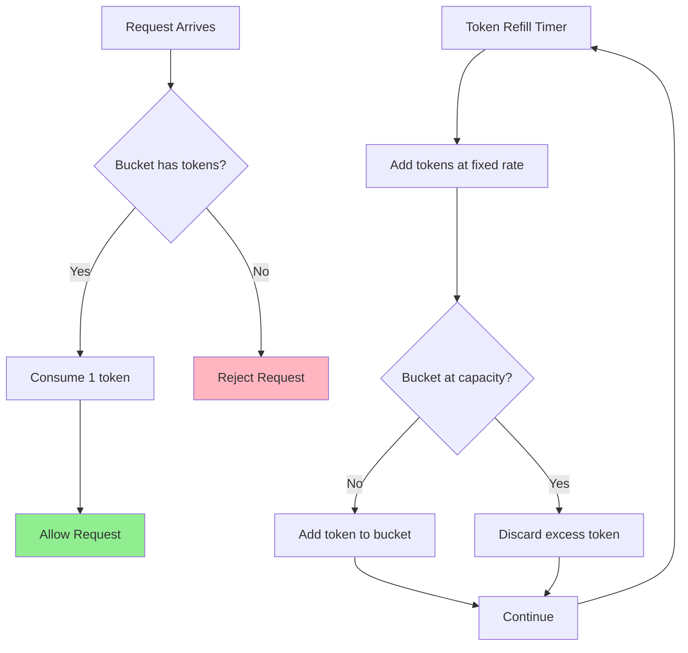

## Overview

Token bucket is one of the most popular rate limiting algorithms used to control the rate of traffic sent to a service. The algorithm is simple, well understood, and commonly implemented by major tech companies.

Companies like Amazon, Stripe, and Shopify use token bucket algorithm to throttle their API traffic and prevent system overload.

## How It Works

Think of it like a bucket that holds tokens:

- **Bucket**: Has a fixed capacity (maximum number of tokens it can hold)
- **Tokens**: Added to the bucket at a fixed rate (refill rate)
- **Request**: Each incoming request consumes one token from the bucket
- **Allow/Deny**: If tokens are available, request is allowed. If bucket is empty, request is rejected.

### Algorithm Steps

1. Initialize bucket with predefined capacity
2. Tokens are added to the bucket at regular intervals (refill rate)
3. When a request arrives:
   - If bucket has tokens → consume 1 token, allow request
   - If bucket is empty → reject request
4. Bucket never exceeds its maximum capacity (excess tokens are discarded)



## Key Parameters

- **Bucket Capacity**: Maximum number of tokens the bucket can hold
- **Refill Rate**: Number of tokens added per time unit (e.g., 10 tokens per second)
- **Token Consumption**: Number of tokens consumed per request (usually 1)

## Example

```
Bucket Capacity: 10 tokens
Refill Rate: 1 token per second
Current Tokens: 5

Request 1 arrives → 5-1 = 4 tokens left → Request allowed
Request 2 arrives → 4-1 = 3 tokens left → Request allowed
...
Request 6 arrives → 0 tokens left → Request rejected
```

### Visual Example

```mermaid
gantt
    title Token Bucket Example (Capacity: 4, Refill: 1/sec)
    dateFormat X
    axisFormat %s
    
    section Bucket State
    4 Tokens    :0, 1
    3 Tokens    :1, 2
    2 Tokens    :2, 3
    1 Token     :3, 4
    2 Tokens    :4, 5
    1 Token     :5, 6
    0 Tokens    :6, 7
    1 Token     :7, 8
    
    section Events
    Request (✓)  :milestone, 1
    Request (✓)  :milestone, 2
    Request (✓)  :milestone, 3
    Refill       :milestone, 4
    Request (✓)  :milestone, 5
    Request (✗)  :milestone, 6
    Refill       :milestone, 7
```



## Pros

- **Allows Traffic Bursts**: Can handle sudden spikes in traffic as long as tokens are available
- **Smooth Traffic**: Refill rate ensures steady traffic flow over time  
- **Simple Implementation**: Easy to understand and implement
- **Memory Efficient**: Only needs to track bucket state (capacity, current tokens, last refill time)
- **Flexible**: Can adjust capacity and refill rate based on requirements

## Cons

- **Parameter Tuning**: Requires careful tuning of bucket size and refill rate
- **Memory Overhead**: In distributed systems, needs shared storage for bucket state
- **Clock Synchronization**: In distributed environments, requires synchronized clocks for accurate refill timing

## Implementation Considerations

### Single Server
- Can be implemented using in-memory counters
- Use timestamps to calculate token refill

### Distributed Systems
- Requires centralized storage (Redis, database) to maintain bucket state
- Consider race conditions when multiple servers access the same bucket
- Network latency may affect performance

## When to Use

Token bucket works well when:
- You want to allow traffic bursts while maintaining overall rate limits
- System can handle variable traffic patterns
- Need a balance between strict rate limiting and user experience

**Note**
> Token bucket is preferred over other algorithms like fixed window when you need to allow traffic bursts while still maintaining long-term rate limits.

## Variations

- **Multi-level Token Buckets**: Different buckets for different rate limits (per user, per IP, per API key)
- **Weighted Tokens**: Different requests consume different numbers of tokens based on complexity
- **Hierarchical Buckets**: Nested buckets for fine-grained control

---
**References:**
- [System Design Interview – An insider's guide, Second Edition - Alex Xu](https://www.amazon.com/System-Design-Interview-insiders-Second/dp/1736049119)
- [Rate Limiting - Stripe Documentation](https://stripe.com/docs/rate-limits)
- [Amazon API Gateway Throttling](https://docs.aws.amazon.com/apigateway/latest/developerguide/api-gateway-request-throttling.html)