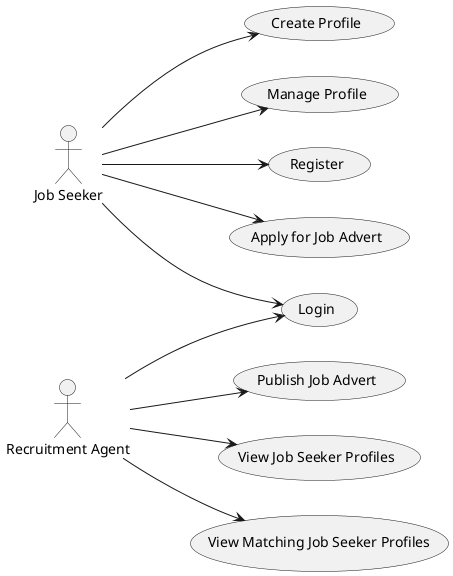

```plantuml
@startuml
left to right direction

(Create Profile) as UC1
(Manage Profile) as UC2
(Login) as UC3
(Register) as UC4
(Apply for Job Advert) as UC5
(Publish Job Advert) as UC6
(View Job Seeker Profiles) as UC7
(View Matching Job Seeker Profiles) as UC8

actor :Job Seeker: as seeker
actor :Recruitment Agent: as agent

seeker --> UC1
seeker --> UC2
seeker --> UC3
seeker --> UC4
seeker --> UC5
agent --> UC3
agent --> UC6
agent --> UC7
agent --> UC8

@enduml
```
