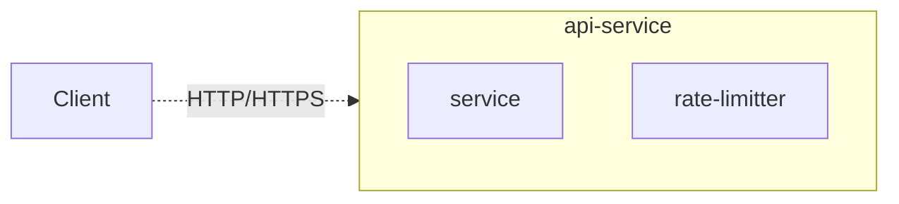

# Designing a Rate Limiter

## Requirements

- Limit excessive requests
- Low latency
- Low memory foot print
- Should support distributed rate limiting
- Exception handling. Should show meaningful error message to user when being throttled
- High fault tolerance. Failure in rate-limiter should not affect the rest of the system

## High Level Design

- Placement of Functionality (Where to put the limiter)
    - **Client side rate limiter**
      While it is technically possible to place the rate limiter on client side this can be highly unpredictable as it can be easily forged. Also we may not always have the control of the client. So it doesn't make much sense to place a rate-limiter in client app
    - **Server side rate limiter**
      Rate limiter can be placed on the app server it self as a part of the application service. 
      
      Pros:
      - 

